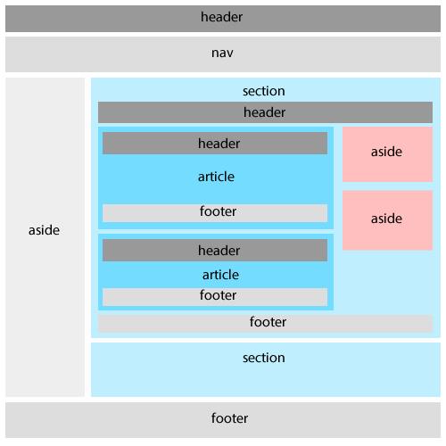

Le web sémantique ne date pas d'hier mais il me semble encore assez peu utilisé. Nous allons créer dans un premier temps une structure de page HTML5 assez simple puis nous allons ajouter des micro-données.

Structure d'une page HTML5
----------------------------------

### La balise "section"
Cette balise permet de définir des zones dans une application, un article ou un document. Cela sera sans doute la balise la plus utilisée dans les documents HTML5.

### La balise "nav"
Cette balise est une "section" particulière qui permet d'identifier les liens de navigation. Bien entendu, tous les liens n'ont pas à être encadrés par cette balise. Toutefois, il faut comprendre que cette balise ne sert pas uniquement pour la navigation principale. Elle peut être utilisée pour l'ensemble des blocs de liens, comme par exemple dans le footer.

### La balise "aside"
L'élément aside représente une "section" également particulière de votre page. Elle permet de définir une zone secondaire adjacent au contenu principale. L'utilisation la plus fréquente est en tant que sidebar.

### La balise "hgroup"
C'est sans doute l'élément le moins utilisé aujourd'hui alors que son utilisation est très pratique. Cela permet de regroupé des tags de titres et sous-titres (h1 -> h6). Par example, un titre avec une baseline.

### La balise "header"
Cette balise représente une section d'introduction. Elle peut être utilisée dans des sections comme "article" par exemple, ou encore dans une section "nav" pour insérer un logo.

### La balise "footer"
Cet élément va être utilisé pour mettre en valeur un contenu de conclusion. Nous pourrons donc trouver un élément footer pour l'application complète mais aussi à l'intérieur d'un article.

> Il faut garder à l'esprit que tout est lié à la hiérarchisation de vos éléments et plus particulièrement à celle de votre contenu.

Par exemple, ces deux approches ne signifient pas du tout la même chose pour l'organisation de votre contenu :

```html
<header>
Mon blog vous parle des outils web !
</header>
<article>
Ceci est un article qui parle de Web sémantique.
</article>
```

```html
<article>
	<header>
	Cet article explique les balises introduites par HTML5
	</header>
Ceci est un article qui parle de Web sémantique.
</article>
```

Construisons une page type pour un blog ! Ci-contre un schémas récapitulatif :


```html

```
